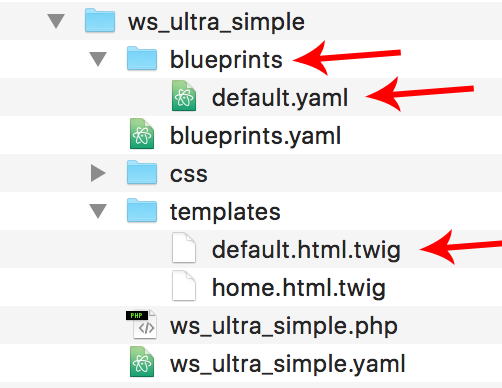
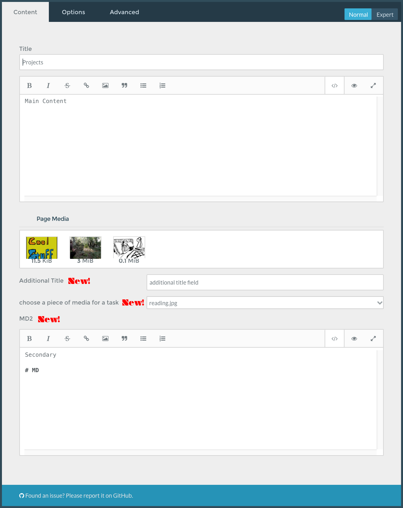

# How to enable custom fields in GRAV & snippets for using them.

#### The following steps will help you setup and will refrence the following files in the places related to your theme folder, in this case my theme is called `ws_ultra_simple`. The files with arrows will the ones which I discuss here.



1. First you need to setup a new folder and file inside the theme directory which connects the template to a new blueprint .yaml file. See image above, then read below.
1. In your theme directory create a new folder named `blueprints`
1. Inside of this new `blueprints` folder create a new file named `yourtemplatename.yaml` for example if you want to add a custom field to the default template create `default.yaml` and put that in the `blueprints folder`
1. The following is some example code to get you up and running with some of the most common custom fields. [Check out this reference for more options](http://learn.getgrav.org/forms/blueprints/reference-fields-available)
1. keep in mind that you can create custom field names and label text below, for example you can rename `header.an_example_text_field` to `header.anything_that_you_want` and you can make the label anything that you would like to show up in the admin panel.

## Part 1 – Setup
The following should be in the .yaml file inside of the blueprints directory see step 3. above.
```yaml
title: Default
'@extends':
    type: default #choose template here, for example, if we are adding custom fields to default.html.twig – then we would put 'default' here under type. if we were adding custom fields to a template coolpage.html.twig, we would put 'page' here.
    context: blueprints://pages

form:
  fields:
    tabs:
      type: tabs
      active: 1

      fields:
        content:
          fields:
                header.an_example_text_field: #creates a text field, notice that the part after header is named something, this can be anything, you will reference it later.
                  type: text
                  label: Additional Title
                header.icon_image: #see comment above, creates a place to select specific media from the uploader, useful for highlighting a featured image, icon or logo
                  type: pagemediaselect
                  label: choose a piece of media for a task
                header.another_markdown_area:  #see comment above, created an additional markdown enabled text editor, useful for multiple text blocks. This is more advanced you must use the |markdown filter to make it appear as markdown in the template file ex: {{page.header.another_markdown_area |markdown}}
                    type: markdown
                    label: MD2
                    showPreview: true
                    validate:
                      type: textarea
```
This is what gets added to the admin panel with the above .yaml file.


## Part 2 – adding the new fields to your template

1. In your template file, for example `default.html.twig`, you can use the header names specified in your `.yaml` file above.
1. The yaml above specifies the first custom field with a name of `header.an_example_text_field` so in the template, we would get this content out with the twig tag `{{page.header.an_example_text_field}}`
1. see example below of how to reference the custom fields outlined above in your template file, for example ``default.html.twig``

```html
<div class="container">

  <!-- custom text field content from default.yaml blueprints file -->
  <h1 class="customTitle">
    {{page.header.an_example_text_field}}
  </h1>

  <!-- custom markdown field content from default.yaml blueprints file -->
  <div class="secondaryMarkdown">
    <!-- you must use the |markdown filter here if you are including a secondary (or more) markdown fields if you would like it to render out the markdown -->
    {{page.header.another_markdown_area |markdown}}
  </div>

  <!-- custom image select field content from default.yaml blueprints file useful for including a specific image somewhere. since it relative, we can just use the twig tag here in an img html tag -->
  

    <!-- main content / markdown area! -->
    <div class="mainContent">
      {{page.content}}
    </div>

</div>
```


