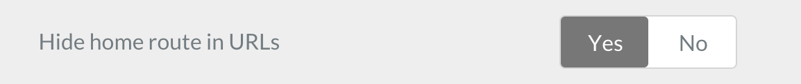

# There are several core variables which can be used in most pages. This is the best place to start.

## Relative or Absolute URL structure

The URL structure can be defined in the admin panel under the configuration tab > system tab > Hide home route in URLs 

If you choose YES to hide the home route in urls use the base_url_absolute variable<br> If you chose NO use the base  else use the base_url_relative variable

### base_url_relative variable

The `{{ base_url_relative }}` returns the base URL to the Grav site, without the host information.

### base_url_absolute variable

`{{ base_url_absolute }}` returns the universal root URL, this is very useful for making a link which always returns to the home page or for building dynamic links.

## theme_url variable

- The `{{ theme_url }}` returns the relative URL to your theme directory.
- Common uses: linking style sheets, or external image files which will never be changed by the content editor, this gives you access to the directory which contains all of your template files, the 'root' directory of your template.

  1. Example: `<link rel="stylesheet" href="{{ theme_url }}/css/default.css" media="screen" title="no title" charset="utf-8">`
  2. Example: ``

## page

`{{ page.content }}` returns the entire HTML content of your page. In the admin panel, this is anything contained in the primary markdown compatible text box for each page.

`{{ page.summary(50) }}` Get a short summary of the {{page.content}}, use the number in the parenthesis to specify how many characters you wish to provide.

`{{ page.title }}` returns the title of your page. This is associated with the 'title' text box in the admin panel

`{{ page.author }}` returns the author of your page. This is associated with the 'author' text box in the admin panel accessible in the configuration tab under the 'site' sub tab.

`{{ page.date }}` returns the date this page was last modified

## images

Get a specific image that has been uploaded, this could be useful if you always have an image like 'logo.png' which you want to be in a specific place.
```twig

```

Get the first image from the media upload box at the bottom of the page editor in the admin panel:
```

{{first_image.html}}
```

Get the last image from the media upload box at the bottom of the page editor in the admin panel:
```

{{last_image.html}}
```

`.cropResize(300, 300)` resizes an image to a smaller or larger size based on the width and the height (change the 300,300 above to any size required). This is useful to create thumbnails, the nice thing about it is that it is not reliant on the source image as GRAV creates whole new image that is just the size that you specify, this can help with load times. The example below uses the 'first image' example above but resizes the image:
```

{{first_image.cropResize(300, 300).html}}
```

